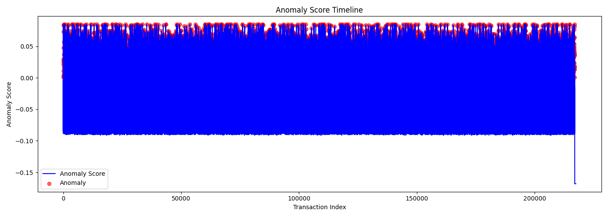

💹 FinGuard — AI Stock Market Fraud & Anomaly Detector.

FinGuard is an AI-powered fraud & anomaly detection system for financial transactions and market trades.
It uses a hybrid model that combines:

AIS (Anomaly Isolation Strategy) → Unsupervised anomaly detection (IsolationForest).

CSA (Classifier Supervised Approach) → Supervised classification (RandomForest) trained on synthetic fraud labels.

Hybrid Ensemble → Blends AIS + CSA scores for stronger fraud detection.

📌 Features

Data Ingestion: Reads transaction/trade CSV data.

Feature Engineering: Scales numeric features for model input.

Anomaly Detection (AIS): Detects unusual trading patterns.

Fraud Classification (CSA): Learns fraud likelihood from labels (synthetic in this dataset, real when available).

Hybrid Prediction: Combines AIS + CSA into a fraud score.

Reporting & Storage: Saves results in CSV, JSON, YAML, and PKL formats.

📂 Project Structure
AI Stock Market Fraud & Anomaly Detector/
│
├── archive/
│   └── financial_anomaly_data.csv     # Input dataset
│
├── processed_trades.h5                # Scaled features
├── anomaly_model.pkl                  # AIS model (IsolationForest)
├── fraud_model.pkl                    # CSA model (RandomForest)
├── hybrid_predictions.csv             # Final predictions
├── finguard_report.json               # JSON summary
├── build_metadata.yaml                # Metadata log
├── finguard_hybrid.py                 # Main pipeline script
└── README.md                          # Project documentation

📊 Input Data

The dataset used is:

archive/financial_anomaly_data.csv

Example Columns

Timestamp → Transaction date & time

TransactionID → Unique transaction ID

AccountID → Customer/Trader ID

Amount → Transaction amount

Merchant → Merchant name or trading counterparty

TransactionType → e.g., Purchase, Transfer, Deposit

Location → Transaction location

⚙️ Pipeline Overview

Load & Clean Data
Reads CSV, selects numeric columns (e.g., Amount, IDs).

AIS (IsolationForest)

Trained unsupervised.

Produces Anomaly Score & Anomaly Flag (-1 anomaly, 1 normal).

Synthetic Labeling

Since no ground-truth labels exist, synthetic labels are generated.

Top 5% of highest anomaly scores → Fraud=1, rest → Normal=0.

CSA (RandomForest)

Trains classifier on synthetic labels.

Produces Fraud Probability.

Hybrid Ensemble

Combines AIS (normalized anomaly scores) + CSA fraud probabilities.

Produces Hybrid Score and final HybridPrediction.

Outputs

Saves predictions + models + reports in multiple formats.

📂 Output Files
File	Description
processed_trades.h5	Scaled numeric features for ML models
anomaly_model.pkl	Saved AIS (IsolationForest) model
fraud_model.pkl	Saved CSA (RandomForest) model
hybrid_predictions.csv	Per-transaction fraud/anomaly predictions
finguard_report.json	JSON summary (counts, model info, outputs)
build_metadata.yaml	Metadata in YAML format
📑 Example Output (hybrid_predictions.csv)
Timestamp	TransactionID	AccountID	Amount	AIS_AnomalyScore	CSA_FraudProb	HybridScore	HybridPrediction
2021-01-01 09:30	100001	12345	250.50	0.42	0.12	0.27	0
2021-01-01 09:31	100002	67890	15000.0	5.81	0.91	0.86	1
🛠️ Installation

Clone or copy project folder

cd "C:\Users\NXTWAVE\Downloads\AI Stock Market Fraud & Anomaly Detector"

Install dependencies

pip install pandas numpy scikit-learn matplotlib seaborn joblib pyyaml

🚀 Usage

Run the hybrid pipeline:

python finguard_hybrid.py

This will generate:

Models (.pkl)

Predictions (hybrid_predictions.csv)

Reports (.json, .yaml)

📊 Next Steps

Replace synthetic labels with real fraud labels if available.

Add sentiment analysis (tweets/news) as extra features.

Deploy with FastAPI or Streamlit for live fraud detection dashboard.

Optimize hybrid weighting (currently 0.5 AIS + 0.5 CSA).

📈 Business Value

Helps regulators & exchanges detect pump-and-dump, spoofing, insider trading.

Supports banks & compliance teams in real-time fraud monitoring.

Builds trust in financial AI systems by offering transparent fraud risk scores.

Author
SAGNIK PATRA
